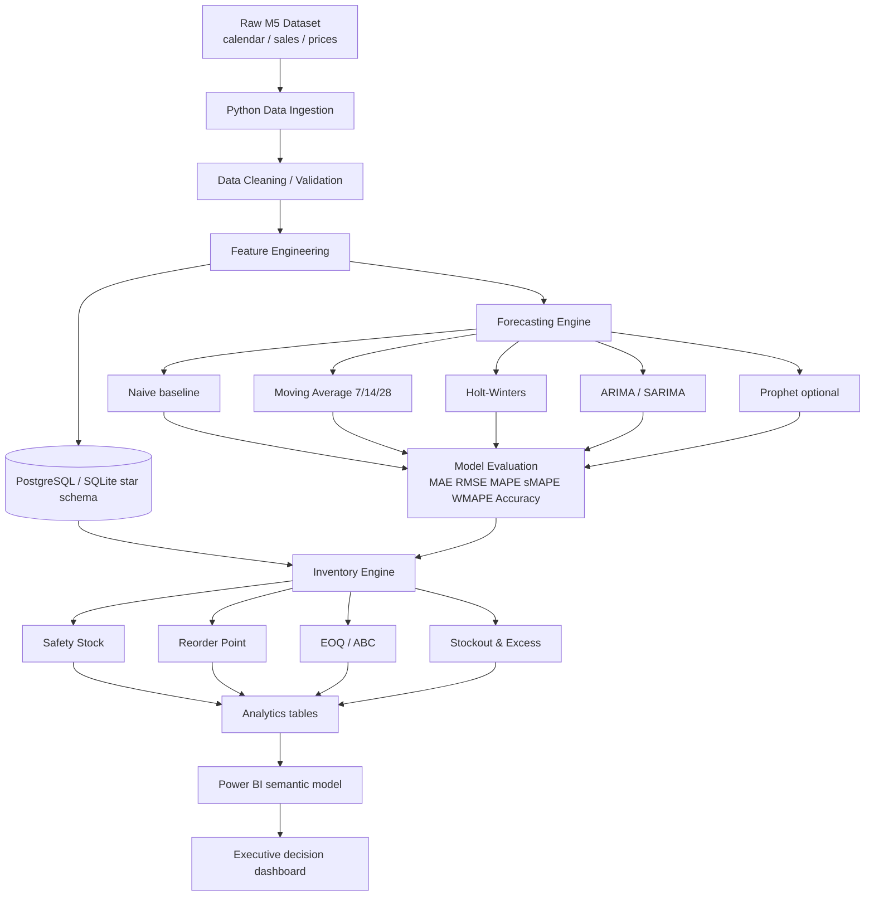

# Architecture

Independent Supply Chain Analytics Project using the public M5 Forecasting dataset.

This platform is a **decision-support system** for demand planners, inventory analysts, and S&OP managers. It is not a generic machine-learning showcase. Every layer maps to a planning question: what will sell, how much stock to hold, when to reorder, and which SKUs need planner attention.

## System diagram



## Layers

| Layer | Role | Interview mapping |
| --- | --- | --- |
| Ingestion & DQ | File, column, duplicate, negative-sales, price, and calendar-gap checks | Data engineering / SAP extract discipline |
| Star schema | `fact_daily_sales` + date/product/store/department dims | BI / SQL modeling |
| Demand features | ADI/CV², CV, seasonality, volume-volatility segments | Demand planning segmentation |
| Forecasting | Chronological 28-day holdout; lightweight models on all eligible series; expensive models on high-value SKUs | Statistical forecasting / IBP |
| Inventory | SS = Zσ√LT, ROP, EOQ, ABC, stockout, excess, turns proxy | Inventory optimization / MRP-DRP thinking |
| Semantic model | Power BI star schema + DAX | KPI dashboards |
| Planner workbench | Recommended action: EXPEDITE / REORDER / MONITOR / REDUCE INVENTORY / NO ACTION | Replenishment planning |

## Scalable modeling strategy

Do not fit Prophet or SARIMA on every SKU/store series.

1. **All eligible series** (history ≥ `MIN_HISTORY_DAYS`, capped by `MAX_FORECAST_SKUS`): Naive + MA 7/14/28.
2. **High-revenue series** (`expensive_model_skus`): Holt-Winters.
3. **Top revenue series**: ARIMA/SARIMA and Prophet (if installed).
4. **Champion model** per series = lowest WMAPE on the chronological validation window.

This mirrors how a demand-planning team would use statistical forecasting in IBP: a baseline for the long tail, richer models where value at risk is high.

## What is calculated vs assumed

| Item | Source |
| --- | --- |
| Daily units, prices, calendar, events, SNAP flags | M5 (or schema-compatible sample) |
| Lead time | Configurable assumption by department |
| Ordering cost / holding cost rate | Configurable scenario parameters |
| On-hand inventory | Simulated scenario position (M5 has no stock ledger) |
| Unit cost | Latest/average sell price as a **proxy**, not a PO cost |
| Inventory turns | COGS proxy = annual consumption value; average inventory = scenario on-hand × unit cost |

Never present assumed parameters as Walmart, SAP, or employer actuals.

## Runtime

```bash
python scripts/run_pipeline.py
```

Default database is SQLite (`data/processed/supply_chain.db`). Set `DATABASE_URL` to PostgreSQL for a warehouse-style load. DDL in `sql/` is PostgreSQL-first and documented for SQL Server portability.
